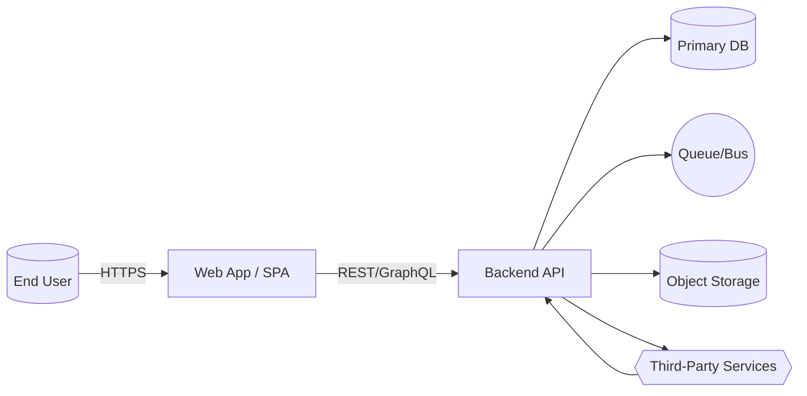

# 01 — System Overview

**Purpose & value proposition**
- One paragraph on what the system does and for whom.

**Scope of this documentation**
- Frontend: tech stack, app types (Web/SPA, mobile), package manager.
- Backend: services, languages, monolith vs microservices.
- Data stores: primary DBs, caches, search.
- Infra: cloud, regions, networking, environments (dev/stage/prod).

**High-level context (C1)**

**Non-functional highlights**
- Availability targets (SLOs), peak load, multi-tenancy approach.
- Data sensitivity: PII/PHI/financial; retention period.
- Compliance posture (SOC 2, ISO 27001, GDPR, etc.).