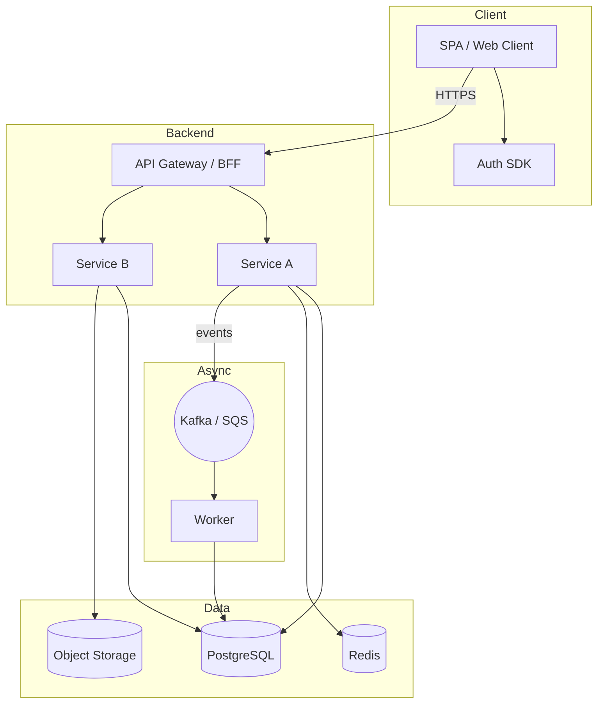
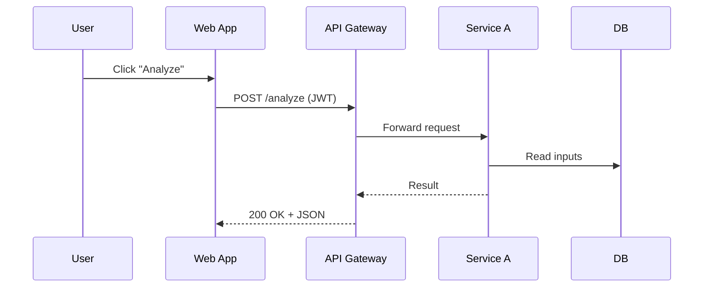

# 02 — Architecture

## Container view (C2)


## Component view (C3) — example service
```mermaid
flowchart LR
  Controller --> ServiceLayer --> Repository
  ServiceLayer --> "Policy/Playbook Engine"
  Repository -->|ORM| PostgreSQL[(PostgreSQL)]
```

## Key request flow (sequence)


> Replace placeholders with your actual services and names. Keep diagrams code-based so they live with the repo.