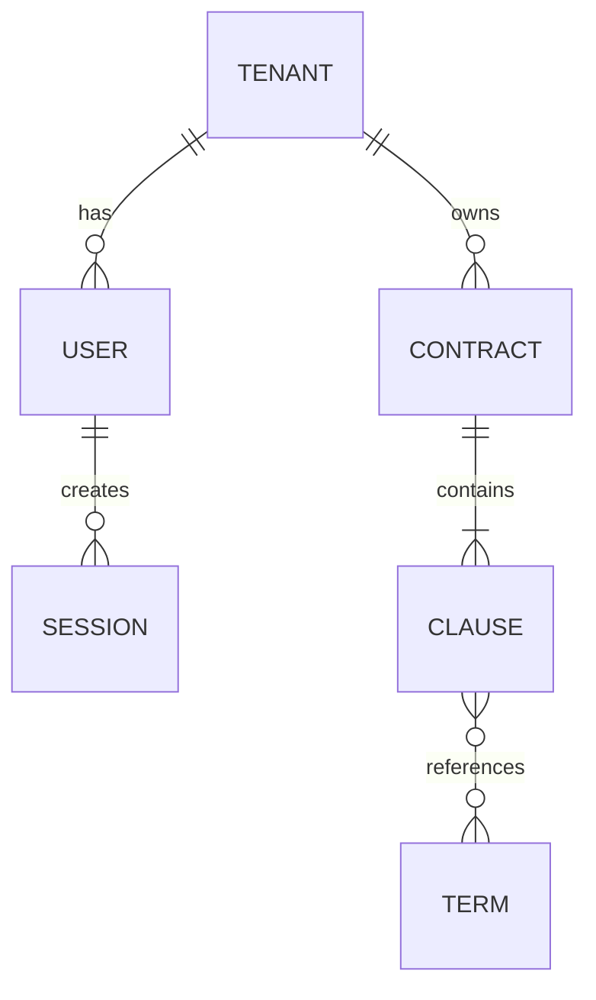

# 03 — Data Model

**Entity relationship (ER)**

**Data classification**
- Public / Internal / Confidential / Restricted (PII/PHI).
- Retention & deletion policy.
- Encryption at rest & in transit (KMS keys, TLS versions).