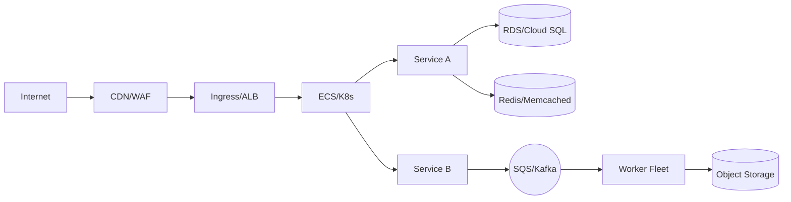

# 06 — Infrastructure & Deployment

**Environments**
- Dev / Stage / Prod; promotion path; feature flags.

**Cloud topology**

**IaC**
- Terraform/CDK/ARM locations; state management; review process.

**CI/CD**
- Build, test, scan, sign images; deploy with canary/blue-green; rollback strategy.